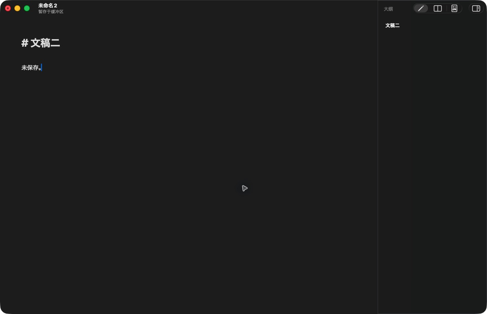

# Downleaf

一款极简、原生、文件优先的 macOS Markdown 编辑器。

Downleaf 把注意力留给正文：没有账号、云端服务、知识库或常驻功能侧栏，只提供可靠的编辑、阅读和长文档导航。



## 功能

- 直接打开和写回标准 `.md`、`.markdown`、`.mdown` 与 `.mkd` 文件。
- `⌘N` 创建缓冲文稿，首次保存时由用户选择位置。
- 自动保存默认开启；未命名文稿仅创建本地恢复副本，不会静默决定保存路径。
- 源码编辑、分屏预览、纯阅读三种模式。
- H1–H6 右侧大纲支持点击定位、章节跟随、折叠和键盘导航。
- 大纲宽度可拖动调整、双击复位，并在窄窗口中自动收起。
- 标准 macOS 菜单、撤销、查找、拼写检查、文本服务与文稿关闭流程。

## 技术栈

- macOS 14+
- Swift 6.2
- AppKit、`NSDocument`、`NSTextView` / TextKit 2
- `NSSplitViewController`、`NSOutlineView`
- SwiftUI（仅用于设置等独立界面）
- WebKit（按需创建阅读预览）

项目采用模块化单体和零运行时第三方依赖。文件是唯一事实来源，不建立内容数据库。

## 使用 Xcode 运行

1. 使用 Xcode 打开 `Downleaf.xcodeproj`。
2. 选择共享的 `Downleaf` Scheme 和 `My Mac`。
3. 按 `⌘R` 构建并运行。

命令行构建：

```sh
zsh scripts/build-app.sh
```

脚本会在仓库根目录生成 `Downleaf.app`。该应用是本地开发构建，不包含面向分发的 Developer ID 签名或公证。

## 测试

```sh
xcodebuild \
  -project Downleaf.xcodeproj \
  -scheme Downleaf \
  -configuration Debug \
  -destination 'platform=macOS' \
  CODE_SIGNING_ALLOWED=NO \
  test
```

也可以运行轻量 Swift Package 测试：

```sh
swift test --disable-sandbox
```

## 工程结构

```text
Downleaf.xcodeproj/  Xcode 工程与共享 Scheme
Downleaf/            App target、源码、Assets、Info.plist、Entitlements
DownleafTests/       单元测试
Design/Icons/        图标母版、备选方案和来源说明
qa/                  原生界面验收截图
prototype/           早期交互原型
scripts/             本地构建与视觉对比脚本
```

产品需求与技术决策见 [PRODUCT_SPEC.md](PRODUCT_SPEC.md)，视觉验收记录见 [design-qa.md](design-qa.md)。

## 贡献

欢迎提交 Issue 和 Pull Request。开始前请阅读 [CONTRIBUTING.md](CONTRIBUTING.md) 与 [CODE_OF_CONDUCT.md](CODE_OF_CONDUCT.md)。安全问题请按照 [SECURITY.md](SECURITY.md) 私密报告。

## License

Downleaf 采用 [MIT License](LICENSE) 开源。
